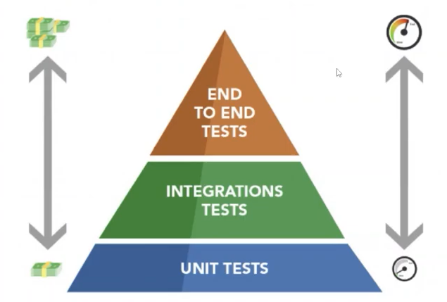

# React TS
  * lib js
  * front tipado com o ts
  * npx create-react-app nome --template typescript
  * styled-components 😭
  * chakra-ui, lib que usa a lib styled components pra fornecer componentes já estilizados
    * npm i @chakra-ui/react @emotion/react @emotion/styled framer-motion
  * testes unitários no typescript com o jest, na mesma pasta do serviço que será testado: clienteApi.ts + clienteApi.test.ts
  

# Desafios
* [ ] Crie os componentes referentes aos elementos na página inicial

* Crie um componente para o header, com o título da aplicação
* Crie um componente para o botão, que aceite onClick como uma das props do componente
* Refatore o componente Card para receber o formulário de login. Ao invés de chamar elemento por elemento na página inicial, apenas o componente Card deve ser chamado.
* [ ] Crie uma função de Boas vindas

* Ao clicar no botão, deve aparecer um alert com uma mensagem de boas vindas
* Crie o teste unitário da função